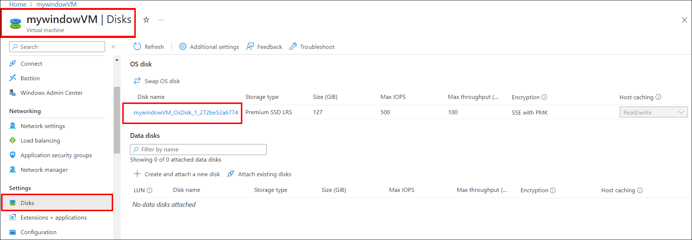
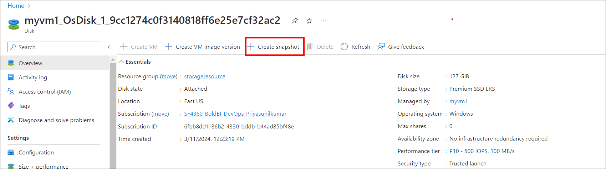
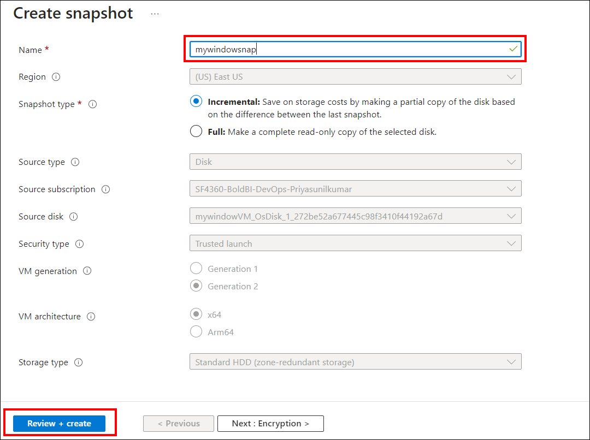
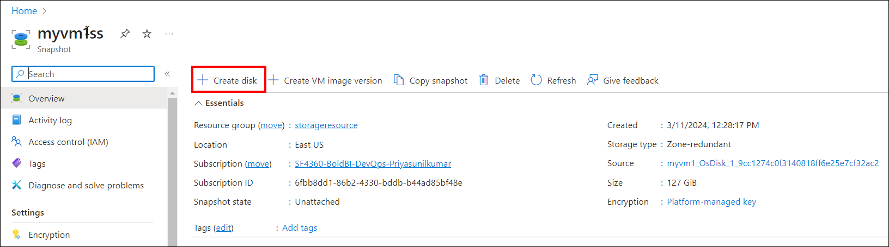
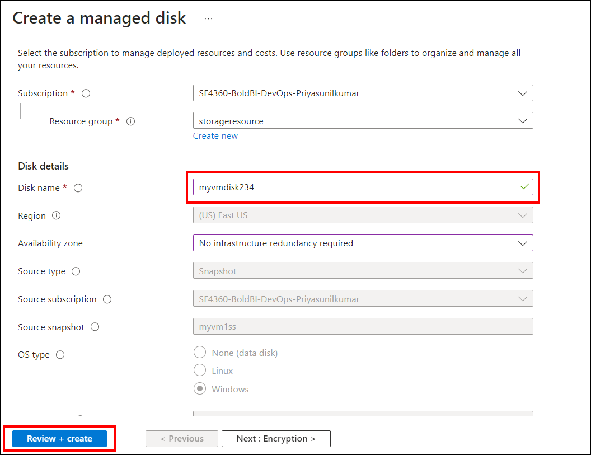
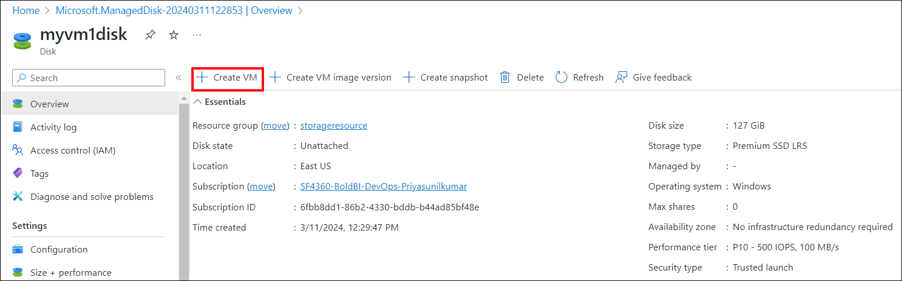
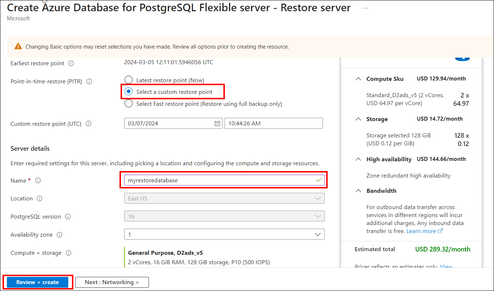
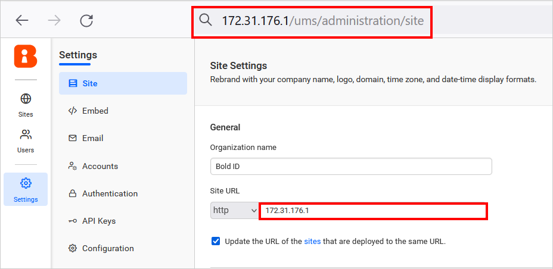
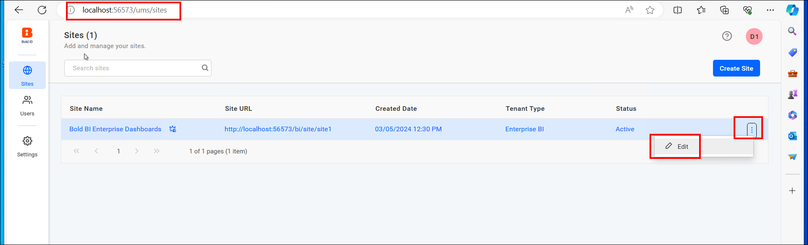
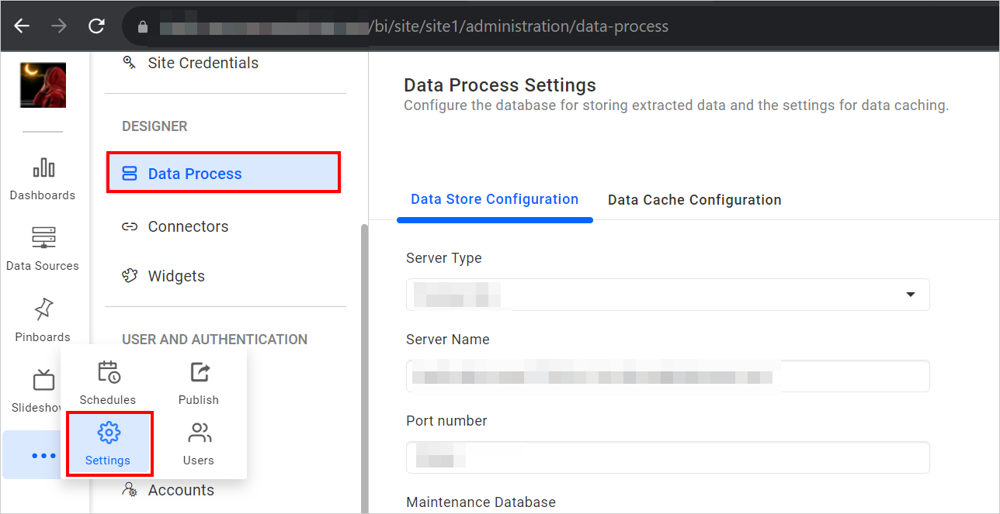

# Steps to Enable Backup Compatibility of Bold BI on Azure Windows VM
To enable the backup compatibility of the Bold BI application on an Azure Windows VM, follow the detailed steps below:

## Create and Restore Snapshots of an Azure Windows Instance
Learn to efficiently manage backups for your Windows VM by following a detailed guide on creating and restoring snapshots in Azure.

**1. Create a Snapshot of the Virtual Machine**
 
- Navigate to the Disk in the Windows VM and click on the disk.
  
- Click `+ create snapshot` in the disk settings to create a snapshot of your Virtual Machine.
  
- Enter the Snapshot name and change the snapshot type to full or incremental. Click on the `Review and create` button.
  

**2. Restore the Virtual Machine from the Snapshot**

- After creating a snapshot of your VM, navigate to your snapshot and create a disk by clicking on `+ create disk`. Enter the disk name and click `Review and create`.
  
  
- Creating a virtual machine (VM) from a snapshot is similar to creating a normal VM, with the main difference being that you start from an existing snapshot instead of a blank VM template. Click on the `+ Create VM` button.
  
- Enter the name of the VM and select the desired storage size. Allow ports HTTP, HTTPS, and RDP in the inbound rules of the VM's network security group. Select the license type as `Windows Server` when prompted. Finally, click on `Review and create`.

**Note:** 
If you are not using a managed database server or an Azure blob container, creating a snapshot of your virtual machine is adequate.

## Backup and Restore Process for PostgreSQL Database (Managed Instance)
Effectively handle database backups with detailed instructions for creating and recovering snapshots in Azure.

**1. PostgreSQL Database Backup**

- Create a PostgreSQL database Backup in Azure, visit: [Backup Azure Database for PostgreSQL](https://learn.microsoft.com/en-us/azure/backup/backup-azure-database-postgresql-flex).
  
**2. PostgreSQL Database Restore**
- For instructions on restoring a PostgreSQL database in Azure, visit: [Restore Azure Database for PostgreSQL](https://learn.microsoft.com/en-us/azure/backup/restore-azure-database-postgresql-flex).

- Go to your original database and click on the "Restore" icon. For `Point-in-time-restore`, select `Select a custom restore point`. Enter your Server name and proceed by clicking on `review and create`. After the restoration process, verify that all data from the original database is present in the restored database.
  

## Reset the Connection String to Use Restored Database and Establish Access to the Application

1. Update the database connection string in the config.xml file. Follow the guidance document to reset the database connection for different environments. Detailed steps can be found in the following documentation: [Reset Application Database on Windows](https://help.boldbi.com/utilities/bold-bi-command-line-tools/reset-application-database/#windows).

2. Check whether the new URL is updated on the UMS administration page. Navigate to URL/ums/administration in the browser and ensure that the new URL is updated. If not, update the new URL on the administration page and save the changes.
   

3. Verify if the new URL is updated on the UMS sites page. Open the Bold BI UMS site listing page and check if it is updated properly.

4. Manually reset each site database. Select the site and choose the edit option.
    
    

5. Click `Next` and provide the restored database details configured for the respective site. Click `Update` to save the changes.
    

6. Navigate to the Settings Icon and select the Data process or Data store.
    
    
7. Update the restored database details and save the changes. Your site will be running with the updated site URL and ready to use.