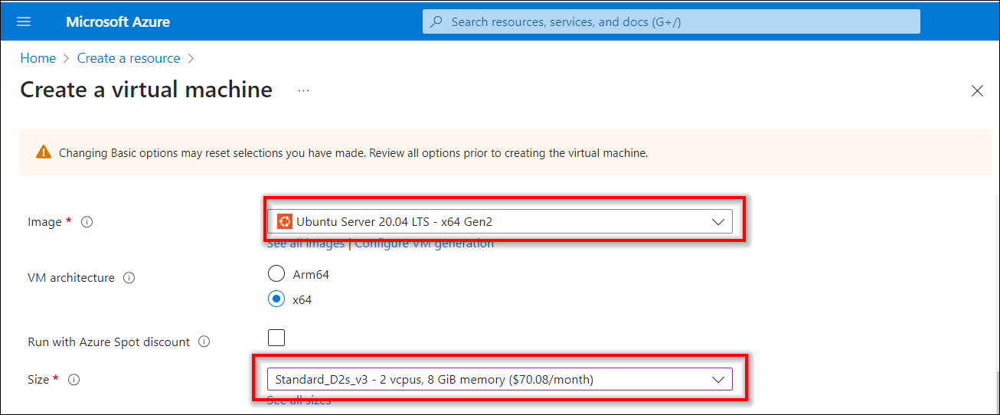

# Self-Deploy a Bold BI Server on Microsoft Azure Linux VM

To install and run the Bold BI server on a Microsoft Azure Linux virtual machine, follow these steps concisely.

### Set Up a Microsoft Azure Linux VM

1. Sign in to the [Azure Portal](https://portal.azure.com/).

2. Click on 'Create a Resource'. Click on 'Virtual Machine'.
    
    

3. Provide the necessary administrative information for the new VM on the 'Basics' blade.
  - **Virtual Machine Name:** Enter a name for your VM (maximum 15 characters).
  - **Subscription:** This VM should be associated with the Azure subscription.
  - **Resource Group:** Choose 'Create new' and enter the name of a new resource group to host the VM’s resources.
  - **Region:** Choose your preferred region for your VM.
    
  - **Image:** Choose the 'Ubuntu Server 20.04' image.
  - **Size:** Choose the VM size that meets our [system requirements](https://help.boldbi.com/deploying-bold-bi/overview/#hardware-requirements).
    
  - **Username:** Enter your username, which you will use to log in to the VM using Terminal.
  - **Password:** Enter your password, as you will need it to log in to the VM using Terminal.
  - **Inbound Ports:** Check the box for 'All ports' for HTTP, HTTPS, and SSL.
    
4. Under the 'Disks' blade, choose the VM OS disk type (SSD is recommended). Choose OS Disk size as per your requirement. Click on 'Review + Create'.
    

### Installation and Running of the Bold BI Server
- Connect to the Azure Linux VM using the [help link](https://learn.microsoft.com/en-us/azure/virtual-machines/linux-vm-connect?tabs=Windows).
- Install Bold BI in the Linux Environment using the [help link](https://help.boldbi.com/deploying-bold-bi/deploying-in-linux/installation-and-deployment/bold-bi-son-ubuntu/).
- Follow the steps in the link to start the application as per the [application startup guide](https://help.boldbi.com/application-startup/).